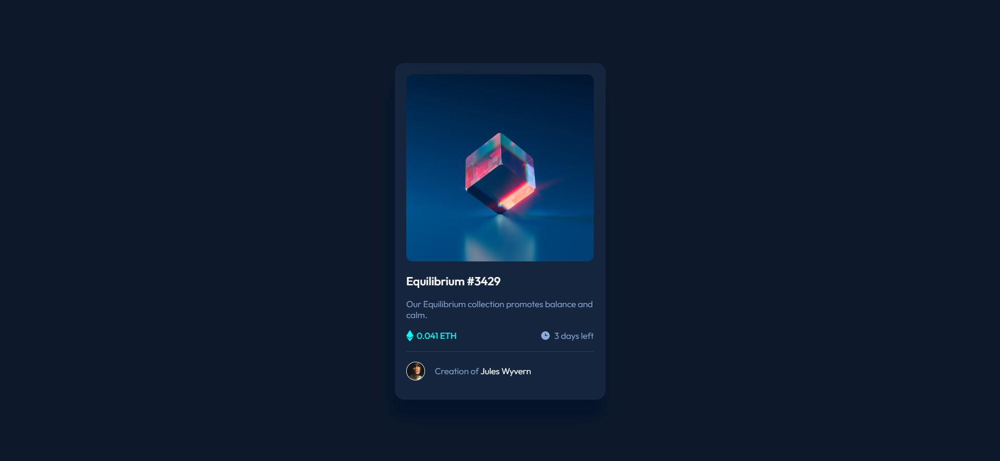
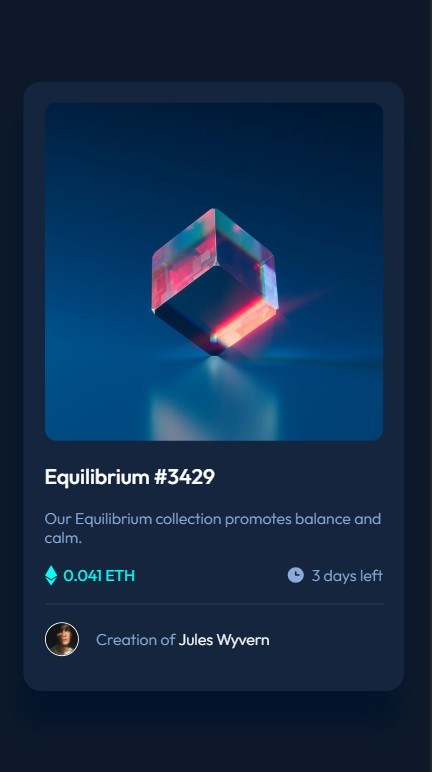

# Frontend Mentor - NFT preview card component solution

This is a solution to the [NFT preview card component challenge on Frontend Mentor](https://www.frontendmentor.io/challenges/nft-preview-card-component-SbdUL_w0U). Frontend Mentor challenges help you improve your coding skills by building realistic projects. 

## Table of contents

- [Overview](#overview)
  - [The challenge](#the-challenge)
  - [Screenshot](#screenshot)
  - [Links](#links)
- [My process](#my-process)
  - [Built with](#built-with)
  - [What I learned](#what-i-learned)
- [Author](#author)

## Overview
  This is a Frontend Mentor challenge I took a few months ago. It is a challenge that helps improve your responsive design skills, demonstrating how you can code a responsive page and incorporate hover states.

### The challenge

Users should be able to:

- View the optimal layout depending on their device's screen size
- See hover states for interactive elements

### Screenshot





### Links

- Solution URL: [Add solution URL here](https://your-solution-url.com)
- Live Site URL: [Live site URL here](https://f-nft-component.netlify.app/)

## My process

  I first started with the HTML part, building the entire structure. Then, I moved on to CSS, adding styles to make the page attractive. Finally, I added media queries to make it responsive.

### Built with

- Semantic HTML4 markup
- CSS custom properties
- Flexbox


### What I learned

  I learned about the use of a particular CSS pseudo-element, which is ::before, as well as the usefulness of the content attribute and the z-index property, which can be used for adding decorative elements or enhancing the visual layout of a webpage. Although I've seen them in tutorial videos before, this will be my first time practicing them.

```css
coin-img:hover::before{
    background: url("images/icon-view.svg") no-repeat center;
    position: absolute;
    content:" ";
    background-color:var(--cyan);
    z-index: 1;
    opacity: 0.5;
    width: 100%;
    height: 100%;
    border-radius: 10px;
}
```

## Author

- Github - [Fortunate](https://github.com/Fortstar09)
- Frontend Mentor - [@Fortstar09](https://www.frontendmentor.io/profile/Fortstar09)
